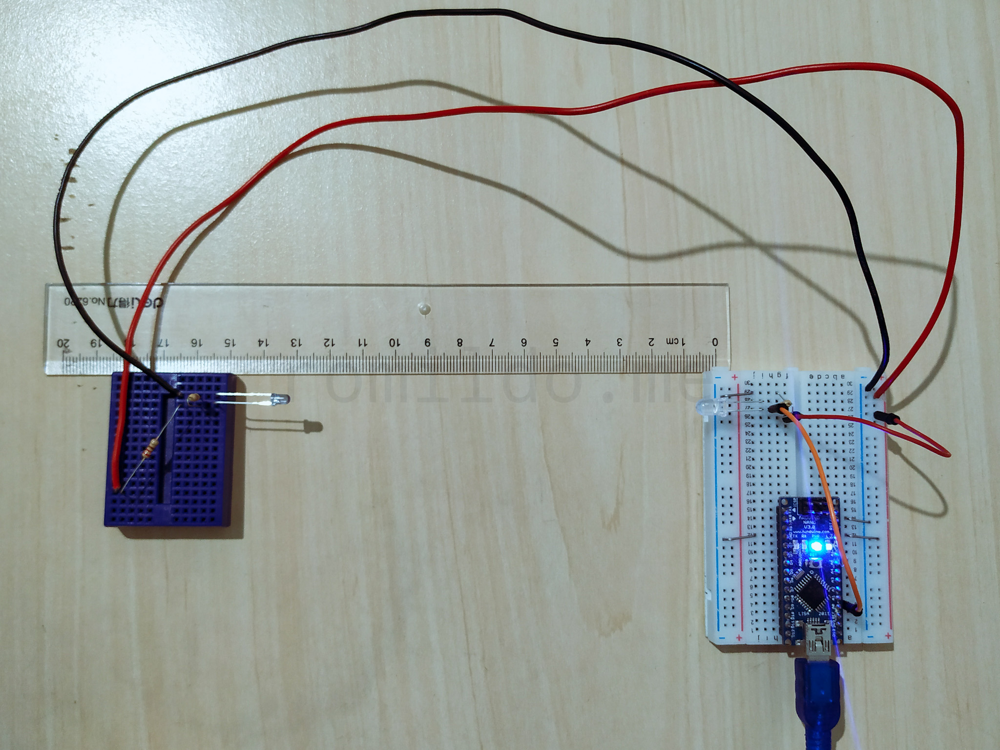
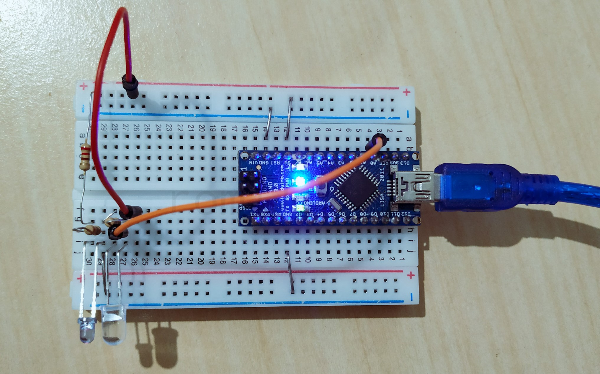
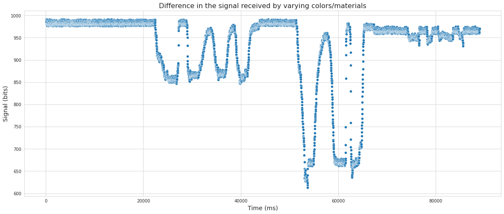
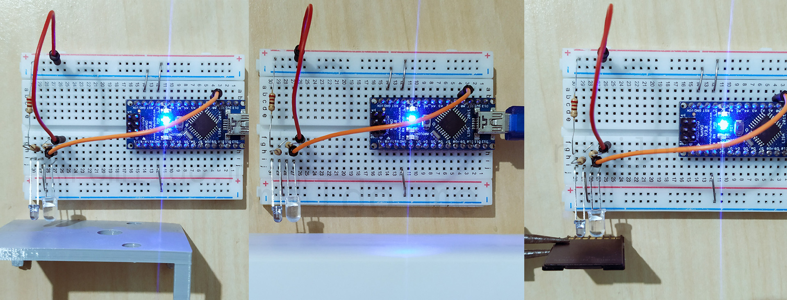

# In Development...

introduction...

## APPLICATIONS

In development...


electrical scheme

### A Simple Implementation




This is one of most simple implementation, The code is very small and you cold be [acesse here](./codes/ir_simple_analog). You can test and set in the line 8 the ***signal_limit***, if the input signal is greater than ***signal_limit*** will be return ***"Infrared signal interrupted"*** on serial.

When moving the infrared source from near the phototransistor and increasing the distance between emitter and receptor, the signal value increases, going from the minimal value (0) when near, to the limit value (1024) when far. But 1024 is the maximum signal and occurs when the infrared is interrupted, so its important work within the distance where the signal received is not near 1024. In my tests worked fine up to 150 mm of the distance between the emitter and the receptor.

Serial output:

```
0 | Infrared signal received
1 | Infrared signal received
4 | Infrared signal received
7 | Infrared signal received
8 | Infrared signal received
7 | Infrared signal received
10 | Infrared signal received
29 | Infrared signal received
223 | Infrared signal received
358 | Infrared signal received
496 | Infrared signal received
615 | Infrared signal received
689 | Infrared signal received
781 | Infrared signal received
821 | Infrared signal received
840 | Infrared signal received
845 | Infrared signal received
846 | Infrared signal received
839 | Infrared signal received
838 | Infrared signal received
839 | Infrared signal received
1015 | Infrared signal interrupted!
1019 | Infrared signal interrupted!
1021 | Infrared signal interrupted!
1023 | Infrared signal interrupted!
832 | Infrared signal received
825 | Infrared signal received
810 | Infrared signal received
795 | Infrared signal received
1015 | Infrared signal interrupted!
1014 | Infrared signal interrupted!
650 | Infrared signal received
614 | Infrared signal received
590 | Infrared signal received
1016 | Infrared signal interrupted!
1017 | Infrared signal interrupted!
516 | Infrared signal received
481 | Infrared signal received
426 | Infrared signal received
1014 | Infrared signal interrupted!
1015 | Infrared signal interrupted!
300 | Infrared signal received
114 | Infrared signal received
4 | Infrared signal received
1023 | Infrared signal interrupted!
2 | Infrared signal received
2 | Infrared signal received
305 | Infrared signal received
667 | Infrared signal received
655 | Infrared signal received
652 | Infrared signal received
651 | Infrared signal received
652 | Infrared signal received
653 | Infrared signal received
```

### An Implementation With Filter
In development...

### A Base Implementation for Line Follower or Color Detector



With the infrared LED beside the phototransistor we can, for example, detect colors by the difference between the absorption/reflection of infrared, another application is with an array of these pairs to make a line follower for robots. In the following graph, it's possible to see the difference in the signal received by varying colors/materials in front of the emitter and receiver with the [code for analog read and moving average filter](./codes/ir_filtered).

Figure 1 - Difference in the signal received by varying colors/materials.


In Figure 1, from the left to the right, it's possible to see that the signal down near 850 bits when I put a gray object in the front of the sensor, the big down of the signal to near 650 has occurred when I put a white object, for black object the signal down from 970/960 to near 950/940, this occurs because white reflects more than gray, which reflects more than black.



### Distance Measurement
In development...

### A Digital Implementation
In development...

## REFERENCES

[1] [Como usar com Arduino – Led Emissor IR e Fototransistor IR](https://blogmasterwalkershop.com.br/arduino/como-usar-com-arduino-led-emissor-ir-e-fototransistor-ir/)
[2] [Arduino + Filtros: Média Móvel](https://youtu.be/AEsAxho1Y-Y)
[3] [Moving Average Filters](https://www.analog.com/media/en/technical-documentation/dsp-book/dsp_book_Ch15.pdf)


### Anotações dos teste

FUNCIONOU BEM E com diferença de aproximadamente 100 bits entre o sinal com ir e com o ir interrompido, isso com 200mm de distância entre o emissor e o receptor, se diminuir a distânica, aquele valor de diferença que é de 100 bits só vai aumentando.